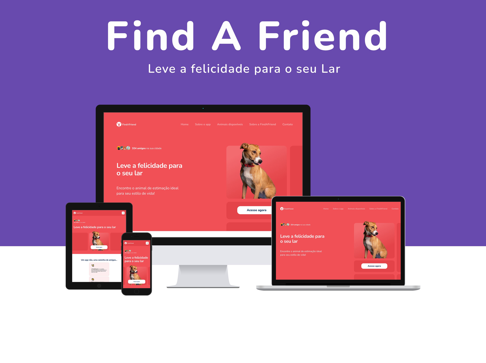

<h1 align="center"> 🐶 FindAFriend 🐱 </h1>

## 📝 Descrição

O FindAFriend é o primeiro projeto do Green Chain Challenge com desafios que simulam situações reais, onde a equipe de desenvolvimento é responsável por aprimorar o produto FindAFriend, desenvolvido pela startup de mesmo nome. Trata-se de uma aplicação que ajuda as ONGs a conectar animais de estimação resgatados com pessoas interessadas em adotá-los.

## 📅 Prazos

- 📅 Data inicial do projeto: 14/03/2023
- 📅 Data final do projeto: 11/04/2023

## 🏢 Perfil da empresa

A FindAFriend é uma startup que prioriza entregas rápidas em detrimento da técnica. O ambiente de trabalho é volátil e suscetível a grandes mudanças em pouco tempo. A equipe é pequena e trabalha em projetos relacionados ao negócio da empresa.

## 🐾 Sobre A FindAFriend

A FindAFriend acredita que todo animal de estimação merece uma vida confortável e segura. Por isso, criou o FindAFriend, que ajuda ONGs e entidades protetoras a conectar pessoas interessadas em adotar animais resgatados. Recentemente, a empresa recebeu um grande investimento de uma indústria de medicina animal e agora precisa evoluir seu único produto ativo para atender às expectativas do investidor.

## 🔍 O FindAFriend

O FindAFriend é um produto desenvolvido pela FindAFriend que permite encontrar o animal de estimação ideal para o estilo de vida do adotante. Nele, as ONGs cadastram os animais disponíveis para adoção, informando suas características, como porte, nível de energia, nível de independência, sociabilidade e gênero. Ao entrar na aplicação, a pessoa interessada em adotar um animal pode filtrar os animais de acordo com suas preferências e estilo de vida. Depois, basta entrar em contato com a ONG para agendar uma visita e conhecer pessoalmente seu animal de estimação.

## 👩🏽‍💻 Perfil do desenvolvedor

O perfil do desenvolvedor para este projeto é de Front-end Júnior.

## 💻 Contexto do desenvolvedor

O desenvolvedor chega na FindAFriend para ajudar no desenvolvimento e suporte de novas ferramentas dentro do FindAFriend. O produto já está em produção e é necessário garantir todas as mudanças antes do final do trimestre para atender às expectativas dos investidores.

## Dados da vaga

FindAFriend
Desenvolvedor(a) Front-end Júnior
Tempo integral · Remoto · Júnior

1-50 funcionários - Startup

Requisitos e qualificações:

- HTML;
- CSS;
- Saber trabalhar com responsividade;
- Saber trabalhar com uma boa semântica;
- JavaScript;
- Consumo de API.

# 🏃‍♂️ Entregas

## 🚀 Sprint 01:

- 🗓️ Data de início: 14/03/2023
- 🗓️ Data da entrega: 21/03/2023

### 📖 História

Os investidores estão planejando uma expansão para a empresa e, para isso acontecer de forma saudável, é preciso atualizar a marca antes que ela alcance novos usuários. A equipe de desenvolvimento deve atualizar a landing page do FindAFriend de acordo com o projeto passado pela agência de publicidade contratada pela startup.

Neste projeto, devemos usar:
- HTML;
- CSS; 
- Javascript;

Na sprint da semana, precisamos entregar a homepage da LP para a versão mobile e desktop.

## 🚀 Sprint 02:

- 🗓️ Data de início: 21/03/2023
- 🗓️ Data da entrega: 28/03/2023

### 📖 História

O diretor revisou o material que a agência mandou e decidiu trocar o menu da versão desktop por um menu em barra convencional depois de ser informado de possíveis problemas de SEO. 

Além de uma alteração do projeto inicial na seção “um app não, uma caixinha de amigos”, que dará mais destaque à imagem do aplicativo. Essa mudança não deve impactar no prazo, pois essa área estava prevista para ser feita apenas na sprint 2 mesmo e ainda não havia sido aprovada pela diretoria.

Na sprint da semana fazer essa mudança no menu e também entregar a segunda seção do site.

## 🚀 Sprint 03:

🗓️ Data de início: 28/03/2023
🗓️ Data da entrega: 03/04/2023

### 📖 História

Após criada a primeira e a segunda seções do site do FindAFriend, uma nova área com informações sobre alguns animais disponíveis por lá será incluida. Essa nova área tem várias fotos de animais disponíveis para adoção, num componente de slide / carrossel.

Na sprint da semana precisa-se desenvolver a Seção “Há muitos amigos esperando por você!” para mobile e desktop. Slider com 3 fotos de animais, com setas indicativas de direção. O Slider deve rodar a partir da ação do usuário e também em um intervalo de tempo de 20 segundos entre as fotos.

### 🔗 Link do Figma

O projeto da landing page está disponível <a href="https://www.figma.com/community/file/1219640728562616972/GCC-%231---FindAFriend" target="_blank">aqui</a>.